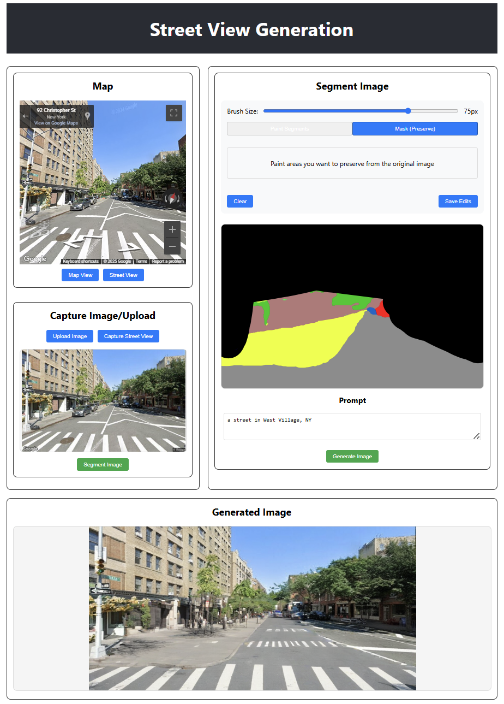

# Stable Diffusion Street: AI-Powered Street View Image Generator

## Overview

Stable Diffusion Street is an application that transforms street view images using AI-powered image generation. The system uses segmentation-based ControlNet with SDXL Turbo to intelligently modify street scenes based on text prompts while preserving the original structure and layout.



## Features

### Map & Image Acquisition
- **Interactive Map Interface**: Navigate and select locations using Google Maps integration
- **Street View Capture**: Directly capture street view images from any location on the map
- **Image Upload**: Upload your own street scene images for transformation

### Image Processing
- **Semantic Segmentation**: Automatically segment street view images into meaningful regions
- **Structure-Preserving Editing**: Maintain the original scene's structure while changing its appearance

### Editing Tools
- **Segmentation Editing**: Edit the semantic segmentation to change the scene through ControlNet
- **Preservation Masking**: Paint areas you want to preserve from the original image

### Generation
- **Text-Prompt Generation**: Transform scenes based on descriptive text prompts

## System Requirements

- Python 3.8+
- PyTorch 1.9+
- CUDA-enabled GPU (recommended)
- 12GB+ GPU memory for optimal performance
- Node.js and npm for the frontend

## Getting Started

1. Clone this repository
2. Install backend dependencies: `pip install -r requirements.txt`
3. Set up environment variables:
   - Copy `frontend/.env.example` to `frontend/.env` and add your Google Maps API key

## Backend Setup

```bash
# Create a virtual environment
python -m venv .venv
# Activate the environment
## On Windows:
.venv\Scripts\activate
## On macOS/Linux:
source .venv/bin/activate
# Install dependencies
pip install -r requirements.txt
# Start the backend server
python app.py
```
The backend will automatically download the required model files on first run (might require huggingface login).

## Frontend Setup

```bash
# Navigate to the frontend directory
cd frontend
# Install dependencies
npm install
# Start the development server
npm start
```

## API Endpoints

- `/segment` - Segment an uploaded image
- `/generate` - Generate a new image based on segmentation and text prompt
- `/health` - Health check endpoint

## Architecture

The application consists of:

1. **Backend**: Flask server that handles image processing, segmentation, and generation
2. **Frontend**: React application with Google Maps integration and image editing capabilities
3. **AI Models**: 
   - SDXL Turbo for image generation
   - UperNet for semantic segmentation
   - ControlNet for structure-preserving image editing

## Notes

- The first run will download model files (~2GB) which will be stored in the `model/` directory (symlinked from the repo)
- For optimal performance, a CUDA-enabled GPU is recommended